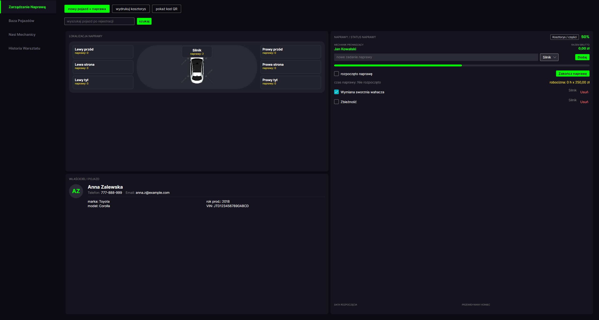
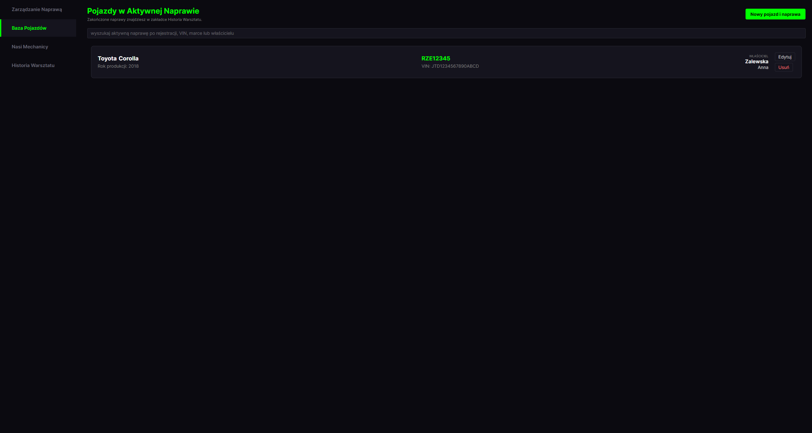
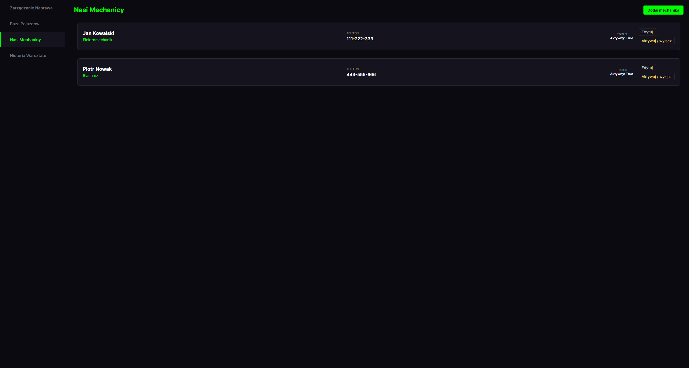
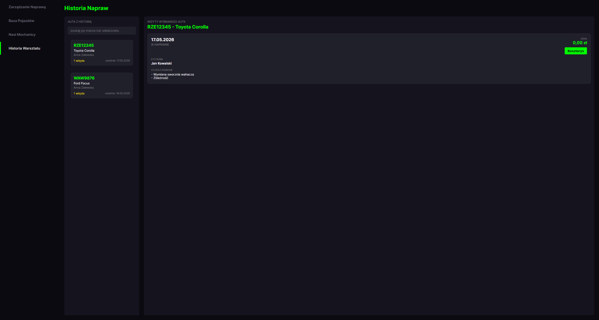
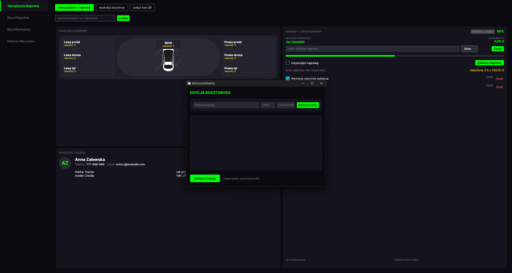
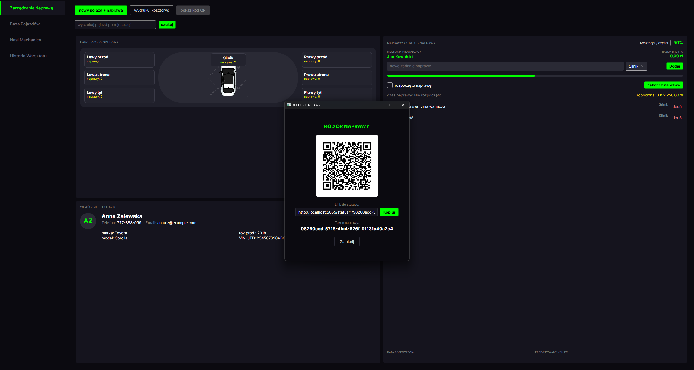
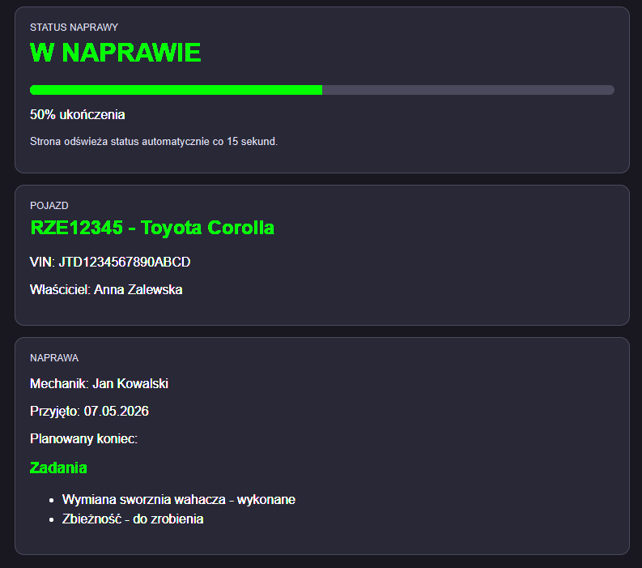

# Warsztat 3000 - system obsługi warsztatu samochodowego

- Uczelnia: Uniwersytet Rzeszowski
- Instytut: Instytut Informatyki
- Kierunek: Informatyka, II rok
- Przedmiot: Programowanie Obiektowe 2, lata akademickie 2025/2026
- Prowadzący: mgr inż. Wojciech Gałka
- Wykonawca: Kamil Szopniewski, nr albumu 134976
- Miejsce i rok: Rzeszów, 2026

Warsztat 3000 to desktopowa aplikacja dla małego lub średniego warsztatu samochodowego. Jej celem jest zebranie w jednym miejscu informacji o klientach, pojazdach, aktywnych naprawach, mechanikach, kosztorysach oraz historii wizyt.

Aplikacja rozwiązuje problem prowadzenia napraw w rozproszonych notatkach, arkuszach lub papierowych zleceniach. Wyróżnia się tym, że poza klasyczną bazą pojazdów ma widok aktywnej naprawy z postępem zadań, kosztorysem, strefami pojazdu oraz lokalnym linkiem QR, który pozwala klientowi podejrzeć status naprawy.

## Uruchomienie projektu (developer)

### Technologie

| Technologia | Wersja w projekcie | Zastosowanie | Link |
| --- | --- | --- | --- |
| .NET SDK | 10.0.202 | Budowanie i uruchamianie aplikacji | [dotnet.microsoft.com](https://dotnet.microsoft.com/) |
| .NET target framework | net10.0 | Docelowa platforma projektu | [learn.microsoft.com/dotnet](https://learn.microsoft.com/dotnet/) |
| Avalonia | 12.0.1 | Desktopowy interfejs użytkownika | [avaloniaui.net](https://avaloniaui.net/) |
| Avalonia.Desktop | 12.0.1 | Uruchamianie aplikacji jako programu desktopowego | [docs.avaloniaui.net](https://docs.avaloniaui.net/) |
| Avalonia.Themes.Fluent | 12.0.1 | Motyw i style kontrolek | [docs.avaloniaui.net](https://docs.avaloniaui.net/docs/basics/user-interface/styling/themes/fluent) |
| CommunityToolkit.Mvvm | 8.4.1 | Komendy i elementy wzorca MVVM | [learn.microsoft.com/dotnet/communitytoolkit/mvvm](https://learn.microsoft.com/dotnet/communitytoolkit/mvvm/) |
| Entity Framework Core SQLite | 10.0.7 | Dostęp do lokalnej bazy SQLite | [learn.microsoft.com/ef/core](https://learn.microsoft.com/ef/core/) |
| Entity Framework Core Tools | 10.0.7 | Narzędzia EF Core | [learn.microsoft.com/ef/core/cli/dotnet](https://learn.microsoft.com/ef/core/cli/dotnet) |
| QRCoder | 1.8.0 | Generowanie kodów QR | [github.com/codebude/QRCoder](https://github.com/codebude/QRCoder) |
| QuestPDF | 2026.5.0 | Przygotowanie kosztorysu do wydruku | [questpdf.com](https://www.questpdf.com/) |
| SQLite | Plik lokalny | Przechowywanie danych aplikacji | [sqlite.org](https://www.sqlite.org/) |

### Wymagania programowe

- System operacyjny: Windows 10 lub Windows 11.
- SDK: `.NET SDK 10.0` lub nowszy zgodny z `net10.0`.
- Runtime dla gotowej wersji: `.NET Desktop Runtime 10.0`, jeśli aplikacja jest publikowana jako `--self-contained false`.
- Baza danych: lokalny plik SQLite, bez instalowania osobnego serwera.

### Proces instalacji

1. Pobierz projekt:

```powershell
git clone <adres-repozytorium>
cd warsztat3000
```

2. Przywróć zależności NuGet:

```powershell
dotnet restore
```

3. Sprawdź, czy projekt się kompiluje:

```powershell
dotnet build
```

4. Zbuduj wersję Release:

```powershell
dotnet build -c Release
```

### Proces konfiguracji

Projekt nie wymaga ręcznego tworzenia pliku `.env` ani ustawiania zmiennych środowiskowych. Połączenie z bazą jest zapisane w kodzie jako lokalny plik:

```text
Data Source=warsztat3000.db
```

Baza danych jest tworzona automatycznie przy starcie aplikacji przez Entity Framework Core. Aplikacja wywołuje `EnsureCreated()`, aktualizuje brakujące elementy schematu i uruchamia seeder danych początkowych.

Nie trzeba wykonywać osobnej komendy migracji. Dane początkowe obejmują przykładowych mechaników, klientów, pojazdy, aktywną naprawę, zakończoną naprawę, zadania i kosztorysy. W aplikacji nie ma systemu logowania, więc nie istnieje domyślne konto administratora.

### Uruchomienie projektu w terminalu

W trybie deweloperskim aplikację można uruchomić poleceniem:

```powershell
dotnet run
```

Jest to aplikacja desktopowa, więc nie udostępnia głównego interfejsu w przeglądarce. Po starcie pojawia się okno `Warsztat 3000`. Dodatkowo aplikacja uruchamia lokalny serwer statusu napraw pod adresem `http://localhost:5055`, używany przez linki QR.

Do przygotowania katalogu z plikiem `.exe`:

```powershell
dotnet publish -c Release -r win-x64 --self-contained false
```

Plik wykonywalny znajduje się wtedy w:

```text
bin/Release/net10.0/win-x64/publish/warsztat3000.exe
```

## Uruchomienie projektu (user)

Użytkownik końcowy nie musi znać kodu projektu. W obecnej wersji nie przygotowano instalatora typu `setup.exe`; aplikację można uruchomić z opublikowanego katalogu `publish`.

Instrukcja dla użytkownika:

1. Otrzymaj katalog z gotową aplikacją, zawierający `warsztat3000.exe` oraz pliki `.dll`.
2. Upewnij się, że na komputerze jest zainstalowany `.NET Desktop Runtime 10.0`.
3. Uruchom plik `warsztat3000.exe`.
4. Po uruchomieniu program sam utworzy lokalną bazę `warsztat3000.db`.

Minimalne wymagania sprzętowe:

- komputer z Windows 10 lub Windows 11,
- procesor x64,
- 4 GB RAM,
- kilkaset MB wolnego miejsca na aplikację i lokalną bazę danych,
- ekran pozwalający wygodnie wyświetlić okno około `1300 x 800 px`.

## Podręcznik użytkownika

### Układ aplikacji

Aplikacja ma cztery główne zakładki dostępne po lewej stronie:

- `Zarządzanie Naprawą` - bieżąca praca nad aktywną naprawą.
- `Baza Pojazdów` - aktywne pojazdy przyjęte do warsztatu.
- `Nasi Mechanicy` - lista mechaników i ich status aktywności.
- `Historia Warsztatu` - historia wizyt i kosztorysów pojazdów.

Nie ma podziału na role użytkowników. Zakładany użytkownik to pracownik warsztatu, który obsługuje przyjęcie pojazdu, zlecenie naprawy, kosztorys i historię.

### Zarządzanie naprawą



Na tym ekranie pracownik widzi najważniejsze dane o aktywnej naprawie. Lewa część pokazuje lokalizację napraw na schemacie pojazdu oraz dane właściciela. Prawa część służy do zarządzania zadaniami, postępem, rozpoczęciem i zakończeniem naprawy.

Typowy przebieg pracy:

1. Kliknij `nowy pojazd + naprawa`.
2. Sprawdź VIN pojazdu.
3. Uzupełnij dane klienta i auta albo wybierz klienta z bazy.
4. Wybierz mechanika prowadzącego.
5. Dodaj planowany koniec i uwagi techniczne.
6. Dodawaj zadania naprawy, wybierając odpowiednią strefę pojazdu.
7. Zaznaczaj wykonane zadania, aby aktualizować procent ukończenia.
8. Po zakończeniu pracy kliknij `Zakończ naprawę`.

Najważniejszy mechanizm tego widoku to automatyczne przeliczanie postępu. Procent ukończenia jest liczony jako udział zadań oznaczonych jako wykonane w całej liście zadań. Ten sam stan jest później widoczny na stronie statusu z linku QR.

### Baza pojazdów



Zakładka `Baza Pojazdów` pokazuje pojazdy, które aktualnie mają otwartą naprawę. Pole wyszukiwania filtruje listę po numerze rejestracyjnym, VIN, marce, modelu, imieniu albo nazwisku właściciela.

Ścieżka użytkownika: dodanie pojazdu i naprawy:

1. Kliknij `Nowy pojazd i naprawa`.
2. Wpisz VIN i wybierz `Sprawdź VIN`.
3. Jeśli VIN istnieje, aplikacja pozwala użyć istniejącego pojazdu.
4. Jeśli VIN jest nowy, uzupełnij rejestrację, markę, model, rok produkcji i dane klienta.
5. Po zapisie pojazdu utwórz naprawę, wybierając mechanika oraz planowany termin.

Ścieżka użytkownika: wyszukanie pojazdu:

1. Wpisz fragment danych w pole wyszukiwania.
2. Lista zawęzi się automatycznie.
3. Kliknięcie pojazdu przenosi do zakładki `Zarządzanie Naprawą`.

### Mechanicy



Zakładka `Nasi Mechanicy` pozwala utrzymywać listę pracowników, którzy mogą prowadzić naprawy. Mechanik ma imię, nazwisko, specjalizację, numer telefonu oraz status aktywności.

Dostępne operacje:

- `Dodaj mechanika` - tworzy nowy wpis.
- `Edytuj` - pozwala poprawić dane mechanika.
- `Aktywuj / wyłącz` - zmienia status aktywności.

Status aktywności pozwala zachować dane mechanika w historii, a jednocześnie odróżnić osoby aktualnie pracujące w warsztacie.

### Historia warsztatu



Historia gromadzi wizyty pojazdów. Po lewej stronie znajduje się lista aut, a po prawej szczegóły wizyt wybranego samochodu.

Ścieżka użytkownika: sprawdzenie historii pojazdu:

1. Otwórz `Historia Warsztatu`.
2. Wyszukaj pojazd po rejestracji, marce albo właścicielu.
3. Wybierz pojazd z listy.
4. Przejrzyj daty wizyt, statusy, mechaników, wykonane czynności i ceny.
5. Kliknij `Kosztorys`, aby otworzyć szczegóły kosztów dla danej wizyty.

### Kosztorys



Kosztorys jest przypisany do konkretnej naprawy. Użytkownik może dodawać części i inne pozycje kosztowe przez nazwę, ilość oraz cenę brutto.

Zasady działania kosztorysu:

- VAT domyślnie wynosi `23%`.
- Suma brutto jest liczona jako `ilość * cena jednostkowa brutto`.
- Suma netto i VAT są wyliczane z wartości brutto.
- Po zakończeniu naprawy system dolicza robociznę.
- Robocizna jest liczona na podstawie czasu od rozpoczęcia do zakończenia naprawy.
- Minimalna liczba roboczogodzin to `1`.
- Stawka roboczogodziny w aplikacji wynosi `250 zł`.

### Kod QR i status naprawy



Kod QR prowadzi do lokalnej strony statusu naprawy. Strona działa, gdy uruchomiona jest aplikacja Warsztat 3000, ponieważ to ona startuje serwer HTTP na porcie `5055`. Jeśli port jest zajęty, aplikacja próbuje kolejnych portów do `5065`.

Przykładowy link QR pobrany z danych demonstracyjnych:

```text
http://localhost:5055/status/1/96260ecd-5718-4fa4-826f-91131a40a2e4
```



### Walidacja i przypadki brzegowe

Aplikacja obsługuje kilka typowych błędów użytkownika:

- VIN musi mieć dokładnie `17` znaków i składać się z liter lub cyfr.
- Rok produkcji musi być z zakresu od `1950` do następnego roku względem aktualnej daty.
- Telefon może zawierać cyfry, spacje, znak `+` i myślniki.
- Email, jeśli jest podany, musi zawierać `@` oraz kropkę po znaku `@`.
- Przy próbie rozpoczęcia pracy bez aktywnej naprawy aplikacja pokazuje komunikat.
- Zakończenie naprawy wymaga wcześniejszego oznaczenia jej jako rozpoczętej.
- Przy usunięciu pojazdu usuwane są też jego naprawy, zadania i pozycje kosztorysu.
- Jeśli pojazd nie ma aktywnej naprawy, w widoku naprawy pojawia się pusty stan zamiast danych zlecenia.

### Dane przechowywane przez system

System zapisuje lokalnie:

- dane klientów: imię, nazwisko, telefon, email i data dodania,
- dane pojazdów: rejestracja, VIN, marka, model, rok produkcji i właściciel,
- dane mechaników: imię, nazwisko, specjalizacja, telefon i aktywność,
- dane napraw: status, daty, postęp, roboczogodziny, token QR i uwagi techniczne,
- zadania naprawy: nazwa, status wykonania i strefa pojazdu,
- pozycje kosztorysu: nazwa, ilość, cena brutto, VAT i typ pozycji.

Dane nie są wysyłane na zewnętrzny serwer. Są przechowywane w lokalnym pliku SQLite `warsztat3000.db`.

## Architektura projektu

Projekt jest podzielony według wzorca MVVM:

- `Models` - klasy domenowe, czyli klient, pojazd, mechanik, naprawa, zadanie i kosztorys.
- `ViewModels` - logika ekranów, komendy, filtrowanie, przeliczanie postępu i kosztów.
- `Views` - interfejs Avalonia, główne zakładki i okna dialogowe.
- `Data` - kontekst bazy SQLite oraz dane startowe.
- `Services` - usługi pomocnicze, m.in. walidacja, obsługa dialogów, katalog marek i lokalny serwer statusu.

Najważniejsze zależności między modułami:

- `MainWindowViewModel` łączy zakładki i przekazuje wybór pojazdu do widoku naprawy.
- `NaprawaViewModel` obsługuje aktywną naprawę, zadania, kosztorys, QR i zakończenie naprawy.
- `PojazdyViewModel` filtruje aktywne pojazdy i pozwala przejść do ich napraw.
- `HistoriaViewModel` buduje historię wizyt na podstawie napraw zapisanych w bazie.
- `WarsztatDbContext` mapuje modele na tabele SQLite.
- `RepairStatusHttpServer` udostępnia lokalną stronę statusu naprawy.

## Baza danych

Aplikacja korzysta z lokalnej bazy SQLite. Plik bazy powstaje automatycznie przy pierwszym uruchomieniu programu:

```text
warsztat3000.db
```

Connection string jest skonfigurowany w `WarsztatDbContext`:

```text
Data Source=warsztat3000.db
```

Nie trzeba instalować osobnego serwera bazodanowego. Aplikacja sama tworzy strukturę bazy przez `EnsureCreated()`, a następnie wywołuje `DatabaseSeeder`, który uzupełnia brakujące elementy schematu i dane startowe.

### Tabele i przeznaczenie

| Tabela | Przeznaczenie |
| --- | --- |
| `Klienci` | Dane właścicieli pojazdów: imię, nazwisko, telefon, email i data dodania. |
| `Pojazdy` | Samochody klientów: rejestracja, VIN, marka, model, rok produkcji i właściciel. |
| `Mechanicy` | Pracownicy warsztatu: imię, nazwisko, specjalizacja, telefon i aktywność. |
| `Naprawy` | Główne zlecenia naprawcze: status, daty, postęp, roboczogodziny, token QR i uwagi. |
| `ZadaniaNaprawy` | Czynności do wykonania w ramach naprawy, razem ze statusem wykonania i strefą pojazdu. |
| `KosztorysPozycje` | Pozycje kosztorysu, czyli części i robocizna z ilością, ceną brutto, VAT i typem pozycji. |
| `MarkiPojazdow` | Słownik marek samochodów wykorzystywany w formularzu pojazdu. |
| `ModelePojazdow` | Modele samochodów przypisane do konkretnych marek. |

### Relacje

- Jeden `Klient` może mieć wiele rekordów `Pojazdy`.
- Jeden `Pojazd` może mieć wiele rekordów `Naprawy`.
- Jedna `Naprawa` jest przypisana do jednego pojazdu i jednego mechanika prowadzącego.
- Jedna `Naprawa` ma wiele rekordów `ZadaniaNaprawy`.
- Jedna `Naprawa` ma wiele rekordów `KosztorysPozycje`.
- Jedna `MarkaPojazdu` ma wiele rekordów `ModelPojazdu`.

### Ograniczenia i reguły integralności

- `Pojazdy.VIN` ma unikalny indeks, ponieważ VIN służy do wykrywania pojazdów już istniejących w bazie.
- `MarkiPojazdow.Nazwa` jest unikalna.
- Para `ModelePojazdow.MarkaPojazduId` i `ModelePojazdow.Nazwa` jest unikalna.
- Relacja `Naprawa -> MechanikProwadzacy` używa ograniczonego usuwania, żeby historia napraw nie znikała razem z mechanikiem.
- Usunięcie pojazdu z poziomu aplikacji usuwa też powiązane naprawy, zadania i kosztorysy.
- Jeśli po usunięciu pojazdu klient nie ma już żadnych aut, aplikacja usuwa również rekord klienta.

### Dane startowe

Przy pierwszym uruchomieniu `DatabaseSeeder` dodaje przykładowe dane:

- mechaników `Jan Kowalski` i `Piotr Nowak`,
- klientów `Anna Zalewska` i `Marek Wójcik`,
- kilka pojazdów testowych, m.in. `Toyota Corolla` i `Ford Focus`,
- aktywną naprawę w statusie `W NAPRAWIE`,
- zakończoną naprawę w statusie `ZAKOŃCZONE`,
- przykładowe zadania naprawy i pozycje kosztorysu.

Seeder nie nadpisuje danych użytkownika. Jeśli w tabeli `Mechanicy` istnieje już jakikolwiek wpis, dane demonstracyjne nie są dodawane ponownie.

### Schemat logiczny

```text
Klienci 1 --- * Pojazdy 1 --- * Naprawy 1 --- * ZadaniaNaprawy
                                      |
                                      * --- * KosztorysPozycje
                                      |
Mechanicy 1 -------------------------*

MarkiPojazdow 1 --- * ModelePojazdow
```

## Dokumentacja kodu C#

W projekcie włączono generowanie pliku XML z komentarzy dokumentacyjnych C#. Odpowiada za to wpis w `warsztat3000.csproj`:

```xml
<GenerateDocumentationFile>true</GenerateDocumentationFile>
```

Projekt dokumentuje wybrane reprezentatywne klasy, a nie każdy trywialny getter lub identyfikator. Dlatego w `.csproj` dodano też:

```xml
<NoWarn>$(NoWarn);1591</NoWarn>
```

Dzięki temu kompilator generuje dokumentację XML, ale nie zasypuje projektu ostrzeżeniami o braku komentarza przy każdej prostej właściwości.

### Udokumentowane elementy

Komentarze XML dodano m.in. do:

- `WarsztatDbContext` - konfiguracja bazy, indeksy i relacje,
- `DatabaseSeeder` - tworzenie schematu i danych startowych,
- `ValidationService` - walidacja emaila, telefonu, VIN i roku produkcji,
- `RepairStatusHttpServer` - lokalna strona statusu naprawy dla kodu QR,
- `NaprawaViewModel` - główny proces aktywnej naprawy,
- `PojazdyViewModel` - lista pojazdów z aktywnymi naprawami,
- `HistoriaViewModel` - historia wizyt i kosztorysów,
- `Pojazd` i `Naprawa` - reprezentatywne modele domenowe.

W komentarzach użyto znaczników takich jak `summary`, `remarks`, `param`, `returns`, `example`, `value` oraz `seealso`.

### Generowanie dokumentacji HTML przez DocFX

DocFX został skonfigurowany w katalogu:

```text
docfx_project
```

Najpierw zbuduj projekt:

```powershell
dotnet build -c Release
```

Następnie wygeneruj i uruchom stronę dokumentacji:

```powershell
docfx docfx_project/docfx.json --serve
```

Po uruchomieniu dokumentacja jest dostępna w przeglądarce:

```text
http://localhost:8080
```

Wygenerowany portal zawiera stronę startową, część o bazie danych oraz sekcję `API` budowaną z komentarzy XML w kodzie C#.